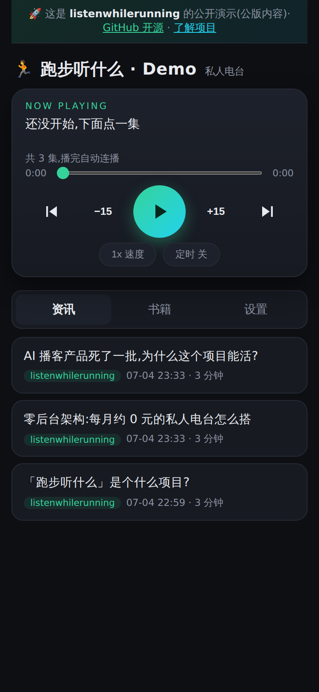
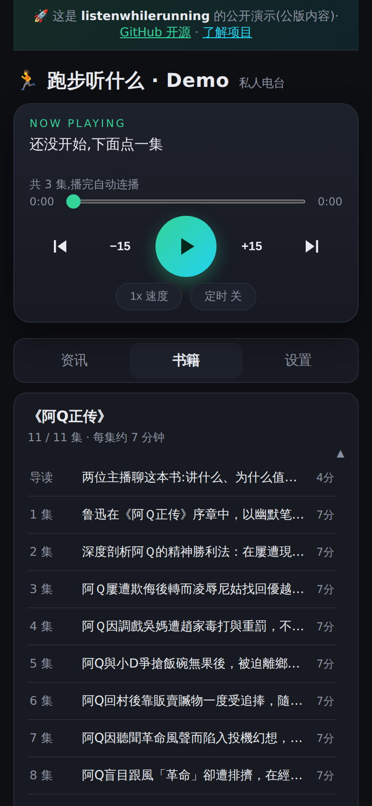

# listenwhilerunning · 跑步听什么

Turn **your own RSS feeds and ebooks** into a personal podcast you can binge on runs and commutes — an **open-source NotebookLM Audio Overview alternative** and **epub/PDF to audiobook** pipeline. Zero backend, no subscription, roughly **$0/month**.

**[Live demo](https://demo.runcast.app)** · [Website](https://runcast.app) · [中文文档 ↓](#中文)

<p align="center">
  
  &nbsp;&nbsp;
  
</p>

- 📰 **News → two-host dialogue podcast**: RSS / subreddits / any article URL → LLM rewrites into a natural conversation → neural TTS → new episodes appear in your podcast app every morning
- 📚 **Ebooks → audiobooks**: upload an epub/mobi/azw3/pdf/txt/html/fb2/docx (even from your phone), get a serialized audiobook plus an AI-generated "hosts discuss this book" intro episode; generation runs ~10x faster than playback, so you can start listening within minutes
- 📡 **Standard podcast RSS**: Apple Podcasts, Pocket Casts, Overcast — anything with "follow by URL" just works
- 🏃 **Runner-friendly PWA player**: lock-screen controls, ±15s skip, speed, sleep timer, offline caching, resume everywhere
- 🧱 **Zero backend**: batch pipeline + object storage + static page, all within free tiers (Cloudflare R2 10GB with free egress, GitHub Actions, Cloudflare Pages)

Architecture and product thinking: [DESIGN.md](./DESIGN.md) · market research: [PRODUCT.md](./PRODUCT.md) · License: **AGPL-3.0**

> ⚠️ The default TTS is the free Edge TTS channel — **personal use only**. For anything commercial, implement the `TtsProvider` interface (MiniMax, ElevenLabs, Azure…). Book files are copyrighted content: `books/` is gitignored, never commit it.

## Quick start (5 minutes)

You need Node 20+, a free Cloudflare account, and optionally an LLM key (any OpenAI-compatible endpoint; without one, episodes fall back to plain readout).

```bash
git clone https://github.com/paceboy/listenwhilerunning.git && cd listenwhilerunning
npm install
cp .env.example .env      # fill just TWO values: R2_ACCOUNT_ID + R2_API_TOKEN (comments show where)
npm run setup             # one command: bucket + public domain + admin token + player deploy
npm run pipeline          # generate your first batch (edit config.json sources first)
```

`setup` prints three things: your **player URL** (bookmark on your phone), a **one-tap login link** (unlocks the settings page: add feeds, queue articles, upload ebooks), and your **podcast feed URL** ("follow by URL" in any podcast app). The script is idempotent — rerun it anytime.

### Daily automation (pick one)

- **GitHub Actions (recommended, no server)**: fork, add your `.env` values as repository secrets, set repo variable `ENABLE_PIPELINE=true`. Runs daily at 22:30 UTC — see [.github/workflows/pipeline.yml](./.github/workflows/pipeline.yml)
- **Your own machine**: cron / systemd timer running `npm run pipeline`; add a 3-minute `npm run poll` timer and player uploads / queued articles go live in minutes instead of next-day
- GHA-only works for uploads too: also set variable `ENABLE_POLL=true` — a 15-minute workflow consumes uploaded books / queued URLs / newsletters (GitHub cron adds 5-15 min platform latency)

### Audiobooks

Upload an **epub/mobi/azw3/pdf/txt/html/fb2/docx directly from the player's settings page** (listening starts minutes later, while the rest generates), or on the server:

```bash
cp somebook.epub books/   # mobi/azw3/fb2/docx need Calibre installed (sudo apt install calibre); GHA installs it automatically when needed
npm run books:sync        # generates the whole book (interruptible, resumes); delete the file + rerun to free space
npm run books:translate -- SomeEnglishBook   # listen to an English book as a Chinese audiobook
```

### Newsletters → podcast (optional)

Give your pipeline an email address: Cloudflare Email Routing → the included [email-worker](./email-worker) parses incoming newsletters into a private R2 inbox, and the pipeline turns them into episodes (group "邮件"/Mail) within minutes. Setup: deploy the worker (`cd email-worker && npx wrangler deploy`), then in the Cloudflare dash enable Email Routing on your domain and route an address (e.g. `read@yourdomain`) to the `lwr-mail` worker. Subscribe your newsletters with that address.

### Single article, right now

Paste a URL in the player settings, or:

```bash
npm run add -- https://example.com/some-article
```

## Architecture

```
scheduled pipeline (GitHub Actions / systemd, daily)
  fetch RSS → LLM dialogue script → neural TTS → upload
  ↓ writes static files only
object storage (Cloudflare R2 / Supabase Storage)
  feed.xml + books.json + mp3 + config.json (editable from the settings page)
  ↓ read-only
podcast apps (subscribe to feed) / web player (Cloudflare Pages, PWA)
```

No servers, no database at runtime. Source layout:

```
src/index.ts      pipeline entry (round-robin topic pick, queue.json consumption)
src/rewrite.ts    dialogue/narration/book-intro/summary prompts + LLM calls (compat endpoint → Gemini → plain fallback)
src/tts.ts        Edge TTS (throttle backoff, XML escaping) + two-host DialogueTts; TtsProvider is swappable
src/syncBooks.ts  full book sync (epub→txt, chunking, intro, summaries, cleanup, player-upload import)
src/setup.ts      one-command deploy;  src/poll.ts  3-min "upload → listening" poller
src/r2.ts         Cloudflare R2 store (CF REST);  src/storage.ts  Supabase implementation
docs/             player (static PWA);  functions/  settings API (Pages Functions);  site/  marketing site
```

## FAQ

- **My favorite site has no RSS?** Self-host [RSSHub](https://docs.rsshub.app/) — nearly everything gets a feed
- **Follow someone on Twitter/X?** Add their profile URL (e.g. `https://x.com/naval`) as a source — recent tweets get bundled into one episode per day. Requires a [SpiderHubs](https://www.spiderhubs.com) API key in `.env` (`SPIDERHUBS_API_KEY`); without it, Twitter sources are simply skipped. SpiderHubs is a credits-based scraping API (you're only charged on successful responses) that also covers **Reddit, Xiaohongshu, TikTok and Douyin** — handy if Reddit's free RSS gets rate-limited on your IP, or as the building block for wiring those platforms into your own pipeline
- **Edge TTS returns empty audio?** Microsoft-side throttling; there's built-in 5-attempt quadratic backoff. Wrap long jobs in a retry loop (systemd unit) for extra safety
- **Dialogue quality not to your taste?** Edit the prompts in `src/rewrite.ts`; set `newsStyle: "narration"` in `config.json` for single-voice readout
- **Change voices?** `voice` / `dialogueVoices` in `config.json`; list voices with `edge-tts --list-voices`
- **Is the TTS really free / allowed?** The Edge TTS endpoint is for **personal use only**. For anything commercial, implement the `TtsProvider` interface with Azure Speech (paid) or any other engine — it's one small class
- **What about book copyright?** You convert books you own, for your own ears. The feed lives at an unguessable storage URL with no public domain attached — keep it that way; don't share or index it
- **Really ~$0/month?** R2 free tier covers 10 GB and charges nothing for egress (the thing that matters for audio). LLM: any OpenAI-compatible endpoint — free tiers cover daily news easily; a whole book on a paid flash-class model costs cents
- **What data leaves my infrastructure?** Article/book text goes to your configured LLM API and to the TTS endpoint. Storage, feed, and player are entirely yours
- **Why AGPL?** So anyone running a hosted clone has to share their changes back

---

## 中文

**跑步听什么**:把你自己订阅的信息源和电子书,每天自动变成能在跑步/通勤时连续收听的私人电台。

- 📰 资讯 → 双主播对谈播客:RSS/Reddit/任意文章链接 → LLM 改写 → TTS 合成,每早自动出现在播客 App
- 📚 电子书 → 有声书:epub/mobi/azw3/pdf/txt/html/fb2/docx 手机上传即转,整本连载 + 一集对话导读;生成比播放快约 10 倍,几分钟后即可边生成边听;英文书可整本翻译成中文再听
- 📡 标准播客 RSS:Apple Podcasts 等任何 App"通过 URL 关注"直接订阅
- 🏃 跑步场景播放器(PWA):锁屏控制、±15s、倍速、睡眠定时、离线缓存、断点记忆
- 🧱 零后台:批处理管线 + 对象存储 + 静态页,全部免费额度(R2 10GB、出口流量免费)

### 5 分钟跑起来

```bash
git clone https://github.com/paceboy/listenwhilerunning.git && cd listenwhilerunning
npm install
cp .env.example .env      # 只需填 R2_ACCOUNT_ID + R2_API_TOKEN 两行(注释里有指路)
npm run setup             # 一键:建存储+公开域名+管理口令+部署播放器,打印三个地址
npm run pipeline          # 生成第一批资讯(config.json 改成你自己的源)
```

`setup` 会打印:**播放器地址**(手机收藏)、**免填口令登录链接**(点一次即登录,解锁设置页:加订阅源/转单篇/传电子书)、**播客订阅地址**。脚本幂等,重复跑不会弄坏已有部署。

### 每日自动(二选一)

- **GitHub Actions(推荐,无需服务器)**:fork 后配 `.env` 同名 secrets + 仓库变量 `ENABLE_PIPELINE=true`,每天 UTC 22:30(北京 06:30)自动跑
- **自己的机器**:cron / systemd 定时 `npm run pipeline`;再配每 3 分钟的 `npm run poll`,上传书/投递文章分钟级生效
- 纯 GHA 也能随传随听:Variables 再加 `ENABLE_POLL=true`,每 15 分钟自动消费上传的书/投递的 URL/newsletter(GitHub 定时有 5-15 分钟平台延迟)

### Newsletter 转播客(可选)

给管线一个专属邮箱:部署 [email-worker](./email-worker)(`cd email-worker && npx wrangler deploy`),在 Cloudflare 后台开启域名的 Email Routing,把某个地址(如 `read@你的域名`)路由到 `lwr-mail` worker;用这个地址订阅 newsletter,来信几分钟内自动变成播客集(分组「邮件」)。

### 听书 / 单篇转换

播放器**设置页直接上传** epub/mobi/azw3/pdf/txt/html/fb2/docx(扫描版 PDF 需先 OCR;Kindle/fb2/docx 格式经 Calibre 转换——自己机器需 `sudo apt install calibre`,GHA 会按需自动装);或服务器上 `cp 书.epub books/ && npm run books:sync`(可中断续传,删文件重跑即释放空间);英文书 `npm run books:translate -- 书名` 整本翻成中文。单篇文章:设置页贴链接,或 `npm run add -- <url>`。

### 常见问题

- **知乎/公众号没有 RSS?** 自托管 [RSSHub](https://docs.rsshub.app/) 或 [wewe-rss](https://github.com/cooderl/wewe-rss)
- **想听 Twitter/X 博主?** 订阅源地址直接填主页 URL(如 `https://x.com/naval`),该账号近几天推文每天聚合成一集;需在 `.env` 配 [SpiderHubs](https://www.spiderhubs.com) 的 `SPIDERHUBS_API_KEY`,不配则 Twitter 源自动跳过。SpiderHubs 是按积分计费的抓取 API(仅成功返回才扣费),还覆盖 **Reddit、小红书、抖音、TikTok**——Reddit 免费 RSS 被限流时可作备选,想把小红书/抖音博主接进自己的管线也能用它做原料
- **Edge TTS 报 empty audio?** 微软端节流,内置 5 次二次方退避;长任务建议 systemd 单元包失败冷却重试
- **对话质量不满意?** 改 `src/rewrite.ts` 的 prompt;`config.json` 的 `newsStyle` 改 `narration` 即单人直读
- **换声音?** `config.json` 的 `voice` / `dialogueVoices`
- **TTS 真的免费/合规吗?** Edge TTS 免费通道**仅限个人自用**;商用请实现 `TtsProvider` 接口换 Azure Speech(付费)等引擎,只是一个小类
- **书的版权?** 转换你自己拥有的书、自己听。feed 挂在无公开域名的随机存储地址上——请保持私有,不要外发或公开索引
- **真的每月 ~0 元?** R2 免费额度 10GB 且出口流量不计费(音频最烧的就是流量);LLM 用任何 OpenAI 兼容端点,免费档足够每日资讯,整本书用 flash 级付费模型也只要几毛钱
- **哪些数据会离开我的设施?** 文章/书的文本会发给你配置的 LLM API 和 TTS 端点,其余(存储/feed/播放器)全在你自己手里
- **为什么 AGPL?** 让任何托管克隆版都必须回馈修改
